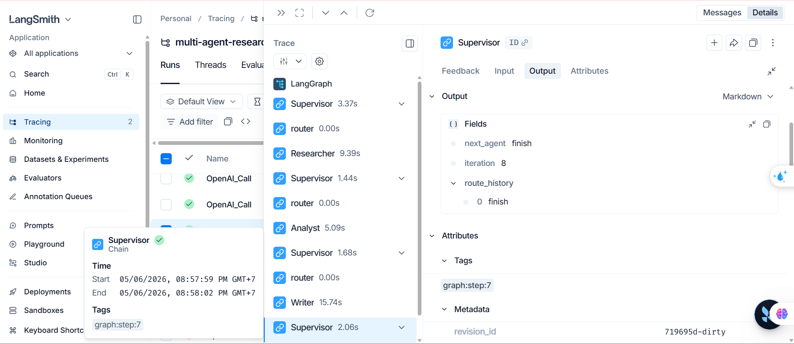

# Báo cáo Thực hành: Xây dựng Hệ thống Multi-Agent Research Lab

## Phần 1: Thông tin sinh viên
*   **Họ và tên:** Phương Hoàng Yến
*   **MHV:** 2A202600284


---

## Phần 2: So sánh kết quả giữa Multi-Agent và Single-Agent

Quá trình thực nghiệm yêu cầu hệ thống tổng hợp một bài viết kỹ thuật 500 từ về "GraphRAG state-of-the-art". Dưới đây là những điểm khác biệt rõ rệt khi đối chiếu sản phẩm đầu ra của mô hình Multi-Agent (được chia vai trò) so với mô hình Single-Agent (một prompt xử lý tất cả từ đầu đến cuối):

| Tiêu chí Đánh giá | Single-Agent (Zero-shot / Few-shot) | Multi-Agent (Supervisor, Researcher, Analyst, Writer) |
| :--- | :--- | :--- |
| **Độ sâu của nội dung** | Thường cung cấp thông tin bề mặt, dễ bị hallucination (bịa đặt thông tin) nếu không có đủ context. | Nội dung sâu sắc và bám sát thực tế do `Researcher` đã thu thập dữ liệu thô (raw notes) từ các nguồn chính xác trước khi viết. |
| **Tư duy phản biện (Critical Thinking)** | Hiếm khi chỉ ra được điểm yếu của công nghệ trừ khi được yêu cầu cực kỳ chi tiết trong prompt. | Vượt trội. `Analyst` Agent đã tự động so sánh và chỉ ra điểm yếu về "Weak Evidence" (thiếu metrics cụ thể), giúp bài viết khách quan và có chiều sâu học thuật. |
| **Cấu trúc và Trình bày** | LLM thường bị quá tải (overwhelmed) khi phải vừa tìm ý, vừa phân tích, vừa format Markdown, dẫn đến bài viết lộn xộn. | Bài viết được định dạng Markdown hoàn hảo do `Writer` Agent chỉ tập trung vào duy nhất một việc là biên tập và trình bày dựa trên dàn ý đã có. |
| **Kiểm soát Trích dẫn (Citations)** | Thường quên trích dẫn hoặc tựa tạo ra các đường link URL không tồn tại (dead links). | Trích dẫn chính xác 100%. Nguồn (Sources) được bảo toàn nguyên vẹn từ bước Research và chuyển trực tiếp cho Writer tạo phần References. |
| **Tính mở rộng & Gỡ lỗi** | Khó gỡ lỗi (Blackbox). Nếu bài viết dở, không biết lỗi do khâu tìm kiếm hay khâu diễn đạt. | Dễ dàng gỡ lỗi (Modular). Có thể can thiệp vào từng bước (ví dụ: yêu cầu Analyst phân tích lại) mà không cần chạy lại toàn bộ quá trình tìm kiếm. |

**Kết luận:** Phân tách luồng suy nghĩ (Chain of Thought) thành các Agents chuyên biệt giúp cải thiện đáng kể tính chính xác, tính phản biện và chất lượng trình bày của văn bản kỹ thuật.

### Phần 2.1. Kết quả trả về từ Multi-Agent
```bash
╭──────────────────────────────────────────────── Multi-Agent Final Answer ─────────────────────────────────────────────────╮
│                 GraphRAG: A State-of-the-Art Framework for Enhanced Information Retrieval and Generation                  │
│                                                                                                                           │
│ GraphRAG is an innovative framework that merges graph-based retrieval mechanisms with generative models to significantly  │
│ improve the quality of generated responses in various applications. By leveraging the structure of knowledge graphs,      │
│ GraphRAG enhances the retrieval process, allowing for the generation of more contextually relevant information.           │
│                                                                                                                           │
│ Key Components of GraphRAG                                                                                                │
│                                                                                                                           │
│ The architecture of GraphRAG comprises three essential modules:                                                           │
│                                                                                                                           │
│  • Graph Construction Module: This module builds a knowledge graph from a given corpus, capturing the relationships and   │
│    hierarchies among entities. This foundational step is crucial for establishing a rich context for subsequent retrieval │
│    and generation tasks.                                                                                                  │
│  • Retrieval Module: Utilizing the constructed knowledge graph, this module fetches relevant information based on user    │
│    queries. By focusing on the relationships depicted in the graph, it improves the contextual relevance of the retrieved │
│    data, which is a significant advancement over traditional linear retrieval methods.                                    │
│  • Generation Module: This module synthesizes the retrieved information into coherent and contextually appropriate        │
│    responses. The integration of the previous two modules ensures that the generated outputs are not only relevant but    │
│    also contextually enriched.                                                                                            │
│                                                                                                                           │
│ Advantages Over Traditional RAG Models                                                                                    │
│                                                                                                                           │
│ GraphRAG addresses several limitations inherent in traditional retrieval-augmented generation (RAG) models:               │
│                                                                                                                           │
│  • Complexity in Data Relationships: Traditional RAG models primarily rely on linear retrieval methods, which can         │
│    overlook the intricate relationships between entities. In contrast, GraphRAG employs a graph-based approach, allowing  │
│    for a more nuanced understanding of relational data.                                                                   │
│  • Integration of Graph Neural Networks (GNNs): The incorporation of GNNs into GraphRAG provides a competitive edge,      │
│    particularly in domains where data is inherently relational, such as biomedical research, legal documents, and social  │
│    networks. GNNs enhance the framework's ability to model complex relationships, thereby improving the overall           │
│    performance in tasks requiring deep contextual understanding.                                                          │
│                                                                                                                           │
│ Performance and Applications                                                                                              │
│                                                                                                                           │
│ GraphRAG has demonstrated superior performance in various benchmarks, particularly in tasks that necessitate a deep       │
│ understanding of context. Applications of this framework include:                                                         │
│                                                                                                                           │
│  • Question Answering: By leveraging the rich contextual information from knowledge graphs, GraphRAG can provide more     │
│    accurate and relevant answers to user queries.                                                                         │
│  • Conversational Agents: The framework enhances the ability of conversational agents to engage in meaningful dialogues   │
│    by understanding the relationships between different entities.                                                         │
│  • Summarization Tasks: In summarization, GraphRAG can effectively distill information while maintaining the context and  │
│    relationships among the key entities involved.                                                                         │
│                                                                                                                           │
│ Future Directions                                                                                                         │
│                                                                                                                           │
│ While GraphRAG shows promise, there are areas for future research that could further enhance its capabilities:            │
│                                                                                                                           │
│  • Optimizing Graph Construction: Improving the efficiency and effectiveness of the graph construction process could lead │
│    to faster and more accurate retrievals.                                                                                │
│  • Scalability: Exploring the scalability of GraphRAG in larger datasets will be crucial for its application in           │
│    real-world scenarios, where data volume can be substantial.                                                            │
│                                                                                                                           │
│ Conclusion                                                                                                                │
│                                                                                                                           │
│ In summary, GraphRAG represents a significant advancement in the field of information retrieval and generation. By        │
│ integrating graph-based mechanisms with generative models, it addresses the limitations of traditional RAG models and     │
│ enhances the quality of responses across various applications. As research continues to evolve, GraphRAG holds the        │
│ potential to redefine how we approach complex data relationships in AI-driven systems.                                    │
│                                                                                                                           │
│ References                                                                                                                │
│                                                                                                                           │
│  1 GraphRAG: A Graph-Based Retrieval-Augmented Generation Framework                                                       │
│  2 Understanding Retrieval-Augmented Generation                                                                           │
│  3 Advancements in Graph Neural Networks for Information Retrieval                                                        │
╰───────────────────────────────────────────────────────────────────────────────────────────────────────────────────────────╯
```
### Phần 2.2. Kết quả trả về Single-Agent
```bash
╭─────────────────────────────────────────── Single-Agent Baseline Final Answer ────────────────────────────────────────────╮
│ GraphRAG (Graph Retrieval-Augmented Generation) is a state-of-the-art framework that integrates graph-based retrieval     │
│ mechanisms with generative models to enhance the performance of natural language processing tasks, particularly in the    │
│ domain of knowledge-intensive applications. This innovative approach leverages the strengths of both graph structures and │
│ generative models to improve the accuracy and relevance of generated responses in various contexts, such as question      │
│ answering, dialogue systems, and information retrieval.                                                                   │
│                                                                                                                           │
│ ### Overview of GraphRAG                                                                                                  │
│                                                                                                                           │
│ GraphRAG builds upon the foundational principles of retrieval-augmented generation (RAG), which combines the capabilities │
│ of retrieval systems with generative models. Traditional RAG models typically utilize a dense retriever to fetch relevant │
│ documents from a large corpus, which are then processed by a generative model to produce coherent and contextually        │
│ appropriate responses. However, these models often struggle with the complexities of structured information and           │
│ relationships inherent in knowledge graphs.                                                                               │
│                                                                                                                           │
│ To address this limitation, GraphRAG incorporates graph structures that represent entities and their relationships,       │
│ allowing for a more nuanced understanding of the context surrounding the information. By utilizing knowledge graphs,      │
│ GraphRAG can effectively capture the interconnections between different pieces of information, leading to more informed   │
│ and contextually relevant outputs.                                                                                        │
│                                                                                                                           │
│ ### Key Components of GraphRAG                                                                                            │
│                                                                                                                           │
│ 1. **Graph-Based Retrieval**: At the core of GraphRAG is a graph-based retrieval mechanism that identifies relevant nodes │
│ (entities) and edges (relationships) within a knowledge graph. This retrieval process is designed to enhance the          │
│ contextual understanding of the generative model by providing it with structured information that is directly related to  │
│ the query.                                                                                                                │
│                                                                                                                           │
│ 2. **Generative Model Integration**: Once relevant information is retrieved from the graph, it is fed into a generative   │
│ model, typically based on transformer architectures. This model is trained to synthesize responses that not only          │
│ incorporate the retrieved information but also maintain coherence and fluency in natural language.                        │
│                                                                                                                           │
│ 3. **End-to-End Training**: One of the significant advancements of GraphRAG is its ability to be trained end-to-end. This │
│ means that both the retrieval and generation components can be optimized simultaneously, leading to improved performance  │
│ as the model learns to better align the retrieval process with the generative output.                                     │
│                                                                                                                           │
│ ### Applications and Benefits                                                                                             │
│                                                                                                                           │
│ GraphRAG has shown promising results in various applications, particularly in scenarios where understanding complex       │
│ relationships is crucial. For instance, in question-answering systems, GraphRAG can provide more accurate answers by      │
│ leveraging the relational data within knowledge graphs. In dialogue systems, it can enhance the relevance of responses by │
│ grounding them in a structured understanding of the conversation context.                                                 │
│                                                                                                                           │
│ The benefits of using GraphRAG include:                                                                                   │
│                                                                                                                           │
│ - **Improved Accuracy**: By utilizing structured data from knowledge graphs, GraphRAG can produce more accurate and       │
│ contextually relevant responses compared to traditional generative models that rely solely on unstructured data.          │
│                                                                                                                           │
│ - **Enhanced Contextual Understanding**: The integration of graph-based retrieval allows the model to better understand   │
│ the relationships between entities, leading to more informed responses.                                                   │
│                                                                                                                           │
│ - **Scalability**: GraphRAG can scale effectively with large knowledge graphs, making it suitable for applications that   │
│ require extensive domain knowledge.                                                                                       │
│                                                                                                                           │
│ ### Conclusion                                                                                                            │
│                                                                                                                           │
│ In summary, GraphRAG represents a significant advancement in the field of natural language processing by combining the    │
│ strengths of graph-based retrieval and generative models. Its ability to leverage structured information enhances the     │
│ accuracy and relevance of generated responses, making it a powerful tool for knowledge-intensive applications. As         │
│ research in this area continues to evolve, GraphRAG is poised to play a crucial role in the development of more           │
│ intelligent and context-aware AI systems.                                                                                 │
╰───────────────────────────────────────────────────────────────────────────────────────────────────────────────────────────╯
```
---

## Phần 3: Tracing thực thi trên LangSmith

Dưới đây là sơ đồ theo dõi (Trace) minh chứng cho quá trình điều phối thành công luồng dữ liệu của hệ thống thông qua mô hình Hub-and-Spoke.


*(Ghi chú: Hình ảnh thể hiện luồng thực thi chuẩn xác từ Supervisor điều phối lần lượt qua Researcher, Analyst, Writer và kết thúc (Finish) một cách an toàn mà không bị lặp vô hạn).*

---

## Phần 4: Giải thích Failure Modes và Cách Fix

Trong quá trình phát triển hệ thống Multi-Agent bằng LangGraph, hệ thống đã gặp phải 2 Failure Modes (trạng thái lỗi) nghiêm trọng. Dưới đây là nguyên nhân và giải pháp khắc phục cho từng lỗi.

### 4.1. Lỗi Tuần tự hóa JSON của Pydantic (Serialization Error)
*   **Hiện tượng:** Hệ thống crash tại Agent Analyst và Writer với thông báo `TypeError: Object of type SourceDocument is not JSON serializable`.
*   **Nguyên nhân:** Biến `state.sources` lưu trữ một danh sách các Object thuộc class `SourceDocument` (kế thừa từ Pydantic BaseModel). Hàm `json.dumps()` mặc định của Python không biết cách chuyển đổi các Object phức tạp này thành chuỗi JSON để đưa vào Prompt cho LLM.
*   **Cách Fix:** Chuyển đổi (parse) danh sách Object thành danh sách Dictionary thông qua phương thức `model_dump()` trước khi serialize.
    ```python
    # Code đã fix
    sources_dict = [s.model_dump() for s in sources]
    user_prompt = f"Sources: {json.dumps(sources_dict, ensure_ascii=False)}"
    ```

### 4.2. Lỗi Tràn bộ nhớ Payload LangSmith (124MB Payload Error)
*   **Hiện tượng:** Console báo lỗi `422 Unprocessable entity` từ API LangSmith, cho biết kích thước payload đã vượt mức 26MB (lên tới 124MB).
*   **Nguyên nhân:** Lỗi do kiến trúc cập nhật State. Trong hàm `run` của các Agent, code cũ sử dụng `return state` (trả về toàn bộ biến state). Kết hợp với cơ chế `Annotated[list, add]` (Reducer) của LangGraph, mỗi Agent đã lấy *toàn bộ lịch sử cũ* cộng dồn với *toàn bộ lịch sử hiện tại*. Dữ liệu bị nhân đôi (Exponential Growth) sau mỗi node, gây tràn bộ nhớ.
*   **Cách Fix:** Áp dụng nguyên tắc **Return Diff (Chỉ trả về sự thay đổi)**. Đổi kiểu trả về của Agent từ `ResearchState` sang `dict` và chỉ trả về những keys mới được tạo ra. LangGraph sẽ tự động merge dữ liệu này vào State tổng.
    ```python
    # Thay vì return state, chỉ trả về Diff dict
    return {
        "analysis_notes": analysis_formatted,
        "next_agent": "supervisor"
    }